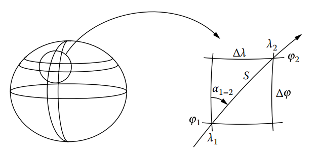
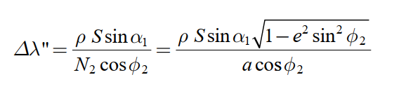
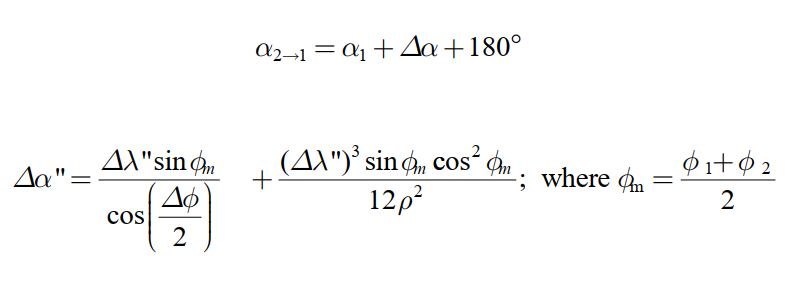

Prof. Gustavo Godoy

El cálculo geodésico directo, hacia adelante, calcula la latitud y longitud de un punto desconocido basado en la latitud y longitud conocidas del punto de comienzo y medida (o dada) la dirección (acimut geodésico) y la distancia (geodesica) desde el punto conocido hasta el punto desconocido. La dirección es el azimut de la línea geodésica en el punto inicial, y la distancia es la distancia de la línea geodésica a lo largo de la superficie elipsoide. Debido al aplanamiento del elipsoide, no existe una ecuación definitiva que pueda usarse sin alguna aproximación. Con los años, los geodestas han ideado numerosos métodos por las cuales el efecto de las aproximaciones requeridas se minimiza y los cálculos del problema directo se realizan de acuerdo con procedimientos específicos. Uno de los procedimientos más populares es el Método Puissant, que es bastante preciso para líneas de hasta 97 km (aprox.) de longitud.

El método de Puissant se ilustra en la siguiente figura y se resume como:

$$
\phi_2=\phi_1+\Delta\phi \qquad (1) \\
\Delta\phi"= S*B*cos(\alpha_1)-S^2*C*sin^2(\alpha_1)-D*(\Delta\phi")-h*S^2*E*sin^2(\alpha_1) \qquad (2)\\
$$

Donde

$$
B=\frac{\rho(segundos)}{M_1(metros)} \qquad (2.1) \\
h=S(metros)*B(\frac{segundos}{metros})*cos(\alpha_1)(segundos) \qquad (2.2) \\
C=\frac{\rho(segundos)*tan(\phi_1)(segundos)}{2*M_1(metros)*N_1(metros)} \qquad (2.3) \\
D=\frac{3*e^2*sin(\phi_1)*cos(\phi_1)}{2*\rho*(1-e^2*sin^2(\phi_1))}\frac{1}{segundos} \qquad (2.4) \\
E=\frac{(1+3*tan^2(\alpha_1))(1-e^2*sin^2(\phi_1))}{6*a^2}\frac{1}{metros}  \qquad (2.5) \\
$$

Las constantes h, B, C, D y E se calculan utilizando ρ = 206,264.8062470964 segundos sexagesimales por radianes, S = la distancia elipsoidal, $α_1$ = el azimut de la línea geodésica, M = el radio de curvatura en el meridiano $M=\frac{a(1-e^2)}{1-e^2*sin^2(\phi)^{\frac{3}{2}}}$, N = elipsoide normal $N=\frac{a}{\sqrt{1-e^2*sin^2(\phi)}}$, a = el semieje mayor del elipsoide, y e^2 = la excentricidad al cuadrado.

Tenga en cuenta que $∆φ"$ aparece en ambos lados de la ecuación 6.75, lo que requiere una solución iterativa. Use $∆φ”= 0$ para la primera iteración y preste mucha atención a las unidades de cada término.

La longitud del punto 2 se calcula como

$$
\lambda_2=\lambda_1+\Delta\lambda \qquad (3)

$$





Tenga en cuenta que la latitud del punto 2 debe calcularse antes de la longitud en el punto
2 porque $φ2$ se usa en la ecuación anterior. El acimut del punto 2 al punto 1 (el reverso
azimut) se puede calcular usando la constante de Clairaut, pero el método Puissant usa la siguiente solución basada en la convergencia, $∆α$:



```{r}
# Problema directo método de Puissant
# Datos
LatA=(23+(10/60)+(52.5451800/3600))*-1 # Latitud geodesica -23º 10' 52.5451800" // 40º 38' 23''
LonA=(54+(35/60)+(54.14560/3600))*-1 # longitud geodesica  -54º 35' 54.14560" // - 73º 46' 44''
AziAB=77+(20/60)+(12.16400/3600) # azimut geodesico de A a B 77º 20' 12.16400" // 53º 30'
DisAB=13979.502  # Distancia geodesica de A a B 13979.502m // 5850e3

# calculo de los parametros del elipsoide
# Datos
a=6378137 #m
f=1/298.257223563
# Calculo de parametros del elipsoide
e2=2*f-f^2   # sqrt((a^2-b^2)/a^2)

# incognitas y orden de trabajo.
# LatB, LonB, AziBA

# Calculo de la latitud del punto B
Rho=206264.8062470964 #seg/rad    ->   1/sin(1") Rho=(3600*180)/pi

MA=(a*(1-e2))/(1-e2*sin(LatA)^2)^(3/2)
B=Rho/MA
N_A=a/sqrt(1-e2*sin(LatA)^2)
C=(Rho*tan(LatA))/(2*MA*N_A) #seg/m^2
D=(3*e2*sin(LatA)*cos(LatA))/(2*Rho*(1-e2*sin(LatA)^2))
H=DisAB*B*cos(AziAB)
E=((1+3*tan(LatA)^2)*(1-e2*sin(LatA)^2))/(6*a^2)
delLat0=(DisAB*B*cos(AziAB))-(DisAB^2*C*sin(AziAB)^2)-(H*DisAB^2*E*sin(AziAB)^2)
delLat1=(DisAB*B*cos(AziAB))-(DisAB^2*C*sin(AziAB)^2)-(D*(delLat0)^2)-(H*DisAB^2*E*sin(AziAB)^2)
delLat2=(DisAB*B*cos(AziAB))-(DisAB^2*C*sin(AziAB)^2)-(D*(delLat1)^2)-(H*DisAB^2*E*sin(AziAB)^2)
delLat3=(DisAB*B*cos(AziAB))-(DisAB^2*C*sin(AziAB)^2)-(D*(delLat2)^2)-(H*DisAB^2*E*sin(AziAB)^2)
delLat4=(DisAB*B*cos(AziAB))-(DisAB^2*C*sin(AziAB)^2)-(D*(delLat3)^2)-(H*DisAB^2*E*sin(AziAB)^2)
delLat5=(DisAB*B*cos(AziAB))-(DisAB^2*C*sin(AziAB)^2)-(D*(delLat4)^2)-(H*DisAB^2*E*sin(AziAB)^2)
delLat6=(DisAB*B*cos(AziAB))-(DisAB^2*C*sin(AziAB)^2)-(D*(delLat5)^2)-(H*DisAB^2*E*sin(AziAB)^2)
delLat7=(DisAB*B*cos(AziAB))-(DisAB^2*C*sin(AziAB)^2)-(D*(delLat6)^2)-(H*DisAB^2*E*sin(AziAB)^2)
LatB=LatA+delLat7

# Calculo de la longitud del punto B
# delLon1=(Rho*DisAB*sin(AziAB))/(NB*cos(LatB))
delLon2=(Rho*DisAB*sin(AziAB)*sqrt(1-e^2*sin(LatB)^2))/(a*cos(LatB))
LonB=LonA-delLon2
# Calculo del azimut geodesico reciproco de la deireccion AB
# Convergencia meridiana
LatM=(LatA+LatB)/2
delAlpha=((delLon2*sin(LatM))/(cos(delLat7/2)))+((delLon2^3*sin(LatM)*cos(LatM)^2)/(12*Rho^2))
AziBA=AziAB+delAlpha+180
```

```{r}
# Problema indirecto método de Puissant
```

