## La elipse
La elipse es el lugar geométrico de todos los puntos (P) de un plano, tales que *la suma de las distancias a otros dos puntos fijos*, llamados focos (F1 y F2), *es constante y es igual al segmento más largo* $\bar{AB}$. Vea la figura 1

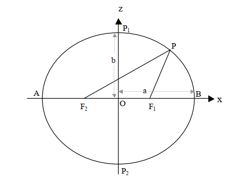

En otras palabras esto se puede expresar como ($D_{ij+kl}=\bar{S1}+\bar{S2}$) donde $D_{ij+kl}$ es la distancia de $D_{AB}=2a$, $\bar{S1}=D_{F_1P}$, $\bar{S2}=D_{F_2P}$. Entonces si sumamos las distancias desde cada foco ($F_1,F_2$) al punto $P$ tenemos $D_{F_1P}+D_{F_2P}$, por definición esto debe ser igual a la distancia $D_{AB}$.

Teniendo presente que la elipse estuviese en el centro de un plano cartesiano $O(0,0)$, los focos estuviesen en el eje x, la distancia de $\bar{F_1O}=\bar{F_2O}=c$, entonces las coordenadas de los focos son $F_1(+c,0)$ y de $F_2(-c,0)$, y las coordenadas del punto son $P(x,z)$ se puede comprobar que:

$$
D_{F_1P}+D_{F_2P} = D_{AB} \qquad como \qquad D_{AB}=2a \qquad entonces \\
D_{F_1P}+D_{F_2P} = 2a \qquad si \qquad
D_{F_1P}=\sqrt{(x+c)^2+(z)^2} \qquad y \qquad D_{F_2P}=\sqrt{(x-c)^2+(z)^2} \qquad se \qquad tiene \\
\sqrt{(x+c)^2+(z)^2}+\sqrt{(x-c)^2+(z)^2}=2a \qquad ecuación \ elipse \\ 
$$
Simplificando ésta expresión se obtiene la *ecuacion ordinara de la elipse* con centro en el origen y eje focal sobre el eje x [ver demostración](http://www.prepa5.unam.mx/wwwP5/profesor/publicacionMate/14X.pdf)

$$
\frac{x^2}{a^2}+\frac{z^2}{b^2}=1 \ Focos \ sobre \ eje \ x \ donde \ a>b \\ 
\frac{z^2}{a^2}+\frac{x^2}{b^2}=1 \ Focos \ sobre \ eje \ z \ donde \ b>a
$$

La elipse tiene tres parametros que definen su forma y tamaño, que son a, b y c($\bar{OF1}=\bar{OF2}$}). Con estos ultimos parametros, es decir b y c, se puede calcular la excentricidad. La **excentricidad** es una medida de cuán circular es la elipse o en otras palabras el grado de aplastamiento del circulo perfecto en el eje z. La excentricidad se encuentra mediante la siguiente fórmula excentricidad = c / a donde c es la distancia desde el centro al foco de la elipse, se define $\sqrt(a^2-b^2)$ denominada excentricidad lineal, y a es la distancia desde el centro a un vértice. Puede calcularse

$$
 e= \frac{c}{a} = \frac{\sqrt{a^2-b^2}}{a}
$$

Donde e es la excentricidad, $\bar{F1F2}$ es a distancia entre los focos o "2c" y AB es el eje mayor de la elipse donde $a>b$

## El elipsoide
El elipsoide es *formado por la rotación del eje menor de una elipse*. El elipsoide de revolución es considerado la mejor aproximación geométrica al tamaño y forma de la tierra, por lo que se usa para hacer cálculos. 


### Parametros elipsoidales

Los **parametros** que describen *tamaño* y *forma* del elipsoide de revolución son:

1. El semieje mayor (a) o eje ecuatorial
2. EL semieje menor (b) o eje polar

La ecuación de la *curva meridiana* (o elipse) es 

$$
\frac{x^2}{a^2}+\frac{z^2}{b^2}=1 \qquad(1)
$$

La superficie de un elipsoide de revolución es

$$
\frac{x^2}{a^2} + \frac{y^2}{a^2}+\frac{z^2}{b^2}=1 \qquad o \qquad \frac{x^2+y^2}{a^2}+\frac{z^2}{b^2}=1 \qquad(1a)
$$

Los puntos F y F' son los focos de la *elipse meridiana* (sinónimo de curva meridiana) que pasa por los puntos P, E', P', E. Los focos son equidistantes del centro geometrico (o) de la elipse. Las distancias PF y PF' son igual al semieje mayor (a).

El *achatamiento o aplanamiento elipsoidal* (o polar) es la relación porcentual de las longitudes de los parametros elipsoidales

$$
f=\frac{a-b}{a} \qquad(2)
$$

Como ejemplo de las magnitudes de estos parámetros para un elipsoide de referencia geodésico, se presentan los valores del elipsoide grs80 (Geodetic Reference System 1980)

a=6378137.000m b=6356752.314m

Usando la ecuación de achatamiento polar se tiene que

```{r}
a=6378137.000; b=6356752.314;
f=(a-b)/a; 
format(f, digits = 10);
f
```

Puesto que el valor del achatamiento es menor que 1, se suele presentar el valor del achatamiento a menudo como $f^{-1}$ que es lo mismo que $\frac{1}{f}$. 
```{r}
1/f
```

El achatamiento polar es aproximadamente $f=\frac{1}{298.2572}$, lo que significa una diferencia de 21.7 km. entre el radio ecuatorial y el radio polar. Este grado de aplanamiento es imperceptible a simple vista, por lo que el esferoide parecería una esfera. Por lo anterior las graficas del elipsoide se exageran con fines aclaratorios.

La *primera* y *segunda* excentricidad son respectivamente

$$
e_a^2=\frac{a^2-b^2}{a^2} \qquad(3) \qquad  y \qquad e_b^2=\frac{a^2-b^2}{b^2} \qquad(4)
$$

Usando la primera y segunda excentricidad respectivamente resulta

```{r}
e1=sqrt((a^2-b^2)/a^2); format(e1, digits = 10);e1
e2=sqrt((a^2-b^2)/b^2); format(e2, digits = 10);e2
```

Además e, f y b pueden relacionarse $e^2=2f-f^2$ y $\sqrt{(1-e^2)}=(1-f)=\frac{a}{b}$. Por lo tanto un elipsoide de revolución o esferoide puede definirse completamente usando dos parametros a y b, o a y f, o a y e, y los parametros restantes se pueden obtener según sea necesario.

Los cuatro parametros a, b, e, (o e') y f; y las relaciones entre ellos son los principales parametros usados en el desarrollo de formulas geodesicas. 


### Radio de curvatura
Sobre la superficie de un elipsoide un número infinito de planos puede dibujarse a traves de unos puntos sobre la superficie que contiene la normal en ese punto. Estos planos son conocidos como *planos normales*. Las curvas de interseccion de los planos normales y las superficies del elipsoide son llamadas *secciones normales*. En cada punto hay dos secciones normales mutuamente perpendiculares cuyas curvaturas son máximas y mínimas y son llamasdas las *secciones normales principales*. Estas secciones principales son las *Secciones normales del meridiano* y *del primer vertical* y sus radios de curvatura son denotados por (M) y (N) respectivamente. 

#### Radio de curvatura del meridiano
La *sección meridiana* en el elipsoide es producida por un plano que contenga al semieje menor o eje polar. Consideremos una sección meridiana de un elipsoide de revolución dado por la ecuación de la elipse en el plano XZ cuyo tamaño y forma estan dados por los parametros a y b.

$$
\frac{x^2}{a^2}+\frac{z^2}{b^2}=1
$$

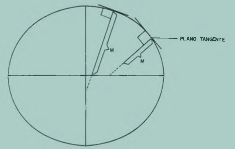

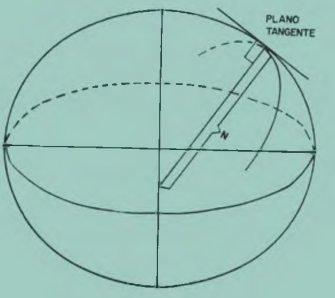

El radio de curvatura de ésta curva esta en cualquier punto "P" esta dado por:

(Philips, 1957 pp. 194-197)

$$
M=\frac{\left [1+\left (\frac{dz}{dx}  \right )^2  \right ]^{\frac{2}{3}}}{\frac{d^2z}{dx^2}} \qquad (5)
$$

En el caso de una elipse meridiana

$$
\frac{dz}{dx}=-\frac{x}{z}+\frac{b^2}{a^2} \qquad (6) \\ 
\frac{d^2z}{dx^2}=-\frac{b^2}{a^2}+\left (\frac{z-x\frac{dz}{dx}}{z^2}  \right ) \qquad (7) \\ \frac{d^2z}{dx^2}=-\frac{b^2}{a^2z^2}\left (z+\frac{x^2}{z} o \frac{b^2}{a^2} \right ) \qquad (7a) \\ 
la \ pendiente \ de \ la \ tangente \ en \ "P" \ esta \ dado \ por \\ 
tan(90°+\phi)=\frac{dz}{dx}=-cot\phi  \qquad (8)
$$

igualando 

$$
-cot\phi=-\frac{x}{z}+\frac{b^2}{a^2} \qquad (9) \qquad o \qquad tan\phi=\frac{a^2}{b^2}\frac{z}{x} \qquad (9a) \\
Sustituyendo \qquad b \qquad por \qquad b=a \left (1-a^2  \right )^{1/2} \qquad (9b) \\
Tenemos \qquad Z=X\left (1-a^2  \right )tan\phi \qquad (10)
$$

Entonces despues de sustituir (b) y (z) en 1 con 9b y 10 respectivamente se tiene

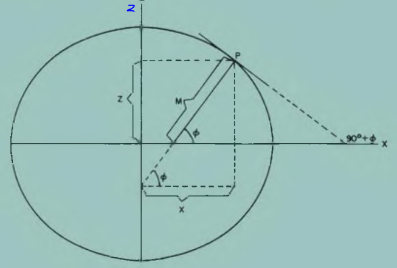

$$
X=\frac{a*cos{\phi}}{\left (1-a^2sen^2\phi  \right )^{1/2}} \qquad (11) \\
Sustituyendo \ 11 \ en \ 10\\
Z=\frac{a(1-e^2)sen\phi}{\left (1-e^2sen^2\phi  \right )^{1/2}} \qquad (12)
$$

Finalmente sustituyendo (X) y (Z) en (6) y (7a), y colocando estos valores en (5) para $\frac{dz}{dx}$ y $\frac{d^2z}{dx^2}$ la expresión para el radio de curvatura del meridiano se convierte:

$$
M=\frac{a(1-e^2)}{\left [1-e^2sen^2\phi  \right ]^{3/2}} \qquad (13)
$$

Como las variables a y e son conocidas M solo depende de la latitud ($\phi$). 

|ecuador ($\phi=0º$)|polo ($\phi=90º$)|
|---|---|
|$M=a(1-e^2) \qquad (13a)$|$M=\frac{a}{\left [1-e^2 \right ]^{1/2}} \qquad (13b)$|

El radio de curvatura aumenta en longitud a medida que el punto sobre el meridiano se mueve del ecuador al polo.

#### Radio de curvatura del primer vertical


De la figura 

$$
cos\phi=\frac{X}{N} \qquad (14) \qquad despejando \ N \qquad N=\frac{X}{cos\phi} \qquad (14a)
$$

Sustituyendo la relacion para X (11) en (14a), resulta la expresion para el radio de curvatura del primer vertical:

$$
N=\frac{a}{\left [1-e^2sen^2\phi  \right ]^{1/2}} \qquad (15)
$$
nuevamente, como el unico parameto variable en (15) es $\phi$, cuando $\phi=0º$ entonces $N=a$.

|ecuador ($\phi=0º$)|polo ($\phi=90º$)|
|---|---|
|$N=a$|$N=M=\frac{a}{\left [1-e^2 \right ]^{1/2}} \qquad (15a)$|

Una cantidad muy importante en el cálculo de geodesia geométrica es el **Radio medio gaussiano de curvatura**, en muchos casos el radio medio es suficientemente preciso para calculos de precisión, que está dado por:

$$
R=\sqrt{MN}=\frac{a \sqrt{1-e^2}}{1-e^2sen^2 \phi}  \qquad (16)
$$
Otro radio de curvatura que puede ser utilizado es el de un paralelo de latitud. Cualquier paralelo de latitud visto desde el polo norte del elipsoide (eje z) describe un circulo. Este radio es igual a la cordenada X. Entonces el radio de curvatura de un paralelo de latitud esta dado por: 

$$
R\phi=N \ cos\phi\qquad (17)
$$
Lo que implica que

|ecuador ($\phi=0º$)|polo ($\phi=90º$)|
|---|---|
|$R\phi=N=a$|$Desaparece$|

Una tabla comparativa sería

|Comparacion|M|N|R|
|---|---|---|---|
|Ecuacion|$M=\frac{a(1-e^2)}{\left [1-e^2sen^2\phi  \right ]^{3/2}} \qquad (13)$|$N=\frac{a}{\left [1-e^2sen^2\phi  \right ]^{1/2}} \qquad (15)$|$R=\sqrt{MN}=  \qquad (16)$|
|Ecuador ($\phi=0º$)|$M=a(1-e^2) \qquad (13a)$|$N=a$|$R\phi=N=a$|
|Polo ($\phi=90º$)|$M=\frac{a}{\left [1-e^2 \right ]^{1/2}} \qquad (13b)$|$N=M=\frac{a}{\left [1-e^2 \right ]^{1/2}} \qquad (15a)$|$Desaparece$|

#### Radio de curvatura en un azimut cualquiera
El radio de curvatura minimo y maximo de un punto cualquiera "P", sobre la superficie de un elipsoide de revolucion está en los *planos meridianos* y *primer vertical respectivamente*.

En algunos casos, los calculos geodesicos requieren el calculo en otro plano que no sea el principal. La sección normal en el azimut $\alpha$ tiene un radio de curvatura en un punto cualquiera P, designado por $R\alpha$. Este se resuelve utilizando el teorema de Euler (Lipschutz, 1969 pag. 196) y es llamado el **Radio de curvatura de Euler**.

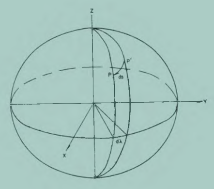

En el punto P donde es requerido el radio de cuurvatura de Euler ($R\alpha$), esta mostrado por la sección PP'. Solamente una parte diferencial de la curvatura de la sección normal (ds) es mostrada, de manera que el azimut $\alpha$ de ésta sección pequeña es equivalente al azimut de una sección normal de cualquier longitud.

El teorema de euler se resuelve como sigue. en el punto P, se dibuja un plano tangente y paralelo a el, otro plano que intersecta la superficie del elipsoide. El ultimo plano visto a través de la normal pasa por P, forma una elipse en el plano BB' donde el plano tangente intersecta la superficie del elipsoide. Los elementos de ésta *indicatriz* son mostrados en la siguiente figura. Si se ve el plano a través del punto P', en el azimut $\alpha$, la sección resultante es la figura 8, recordando que la ecuación de la elipse es

$$
\frac{x^2}{a^2}+\frac{y^2}{b^2}=1 \\ \frac{y^2}{a^2}+\frac{x^2}{b^2}=1
$$


de la figura anterior

$$
X=ds*sen(\alpha) \\ Y=ds*cos(\alpha) \qquad (17)\\ reemplazando... \frac{x^2}{a^2}+\frac{y^2}{b^2}=1 \\ \frac{ds^2*sen^2(\alpha)}{m^2}+\frac{ds^2*cos^2(\alpha)}{n^2}=1 \qquad (18)
$$

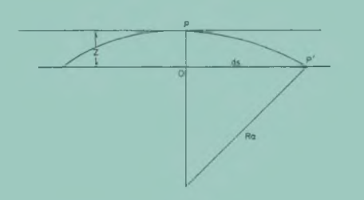

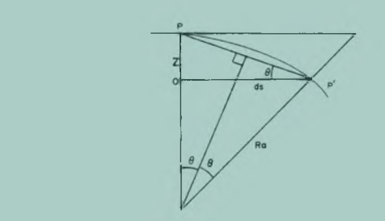

Usando la figura anterior podemos escribir

$$
Sen\theta =\frac{Z}{C} \qquad (19) \\ y \\ Sen\theta =\frac{\frac{1}{2}C}{R\alpha} \qquad (20) \\ resulta \\ Z =\frac{C^2}{2R\alpha} \qquad (21)
$$
De manera que si PP' es una distancia diferencial muy pequeña entonces $C \approx ds$ y se puede decir

$$
Z =\frac{ds^2}{2R\alpha} \qquad (22)
$$
Cuando 

|($\alpha=0º$)|polo ($\phi=90º$)|
|---|---|
|(S) es igual a (n)|(S) es igual a (m)|
|$Z=\frac{n^2}{2M}$ \qquad (23)|$Z=\frac{m^2}{2N}$ \qquad (24)|

Combinando (22) y (23); y (22) y (24) se tiene 

$$
n^2 =\frac{ds^2}{R\alpha}M \qquad (25) \qquad m^2 =\frac{ds^2}{R\alpha}N \qquad (26) \\ sustituyendo \qquad n^2 \qquad m^2 \qquad en \ 18  \\ \frac{ds^2*sen^2(\alpha)}{m^2}+\frac{ds^2*cos^2(\alpha)}{n^2}=1 \qquad resulta \\ \frac{R\alpha *sen^2(\alpha)}{N}+\frac{R\alpha *cos^2(\alpha)}{M}=1  \qquad (27) \qquad finalmente \\ R\alpha=\frac{MN}{Msen^2\alpha+Ncos^2\alpha} \qquad (28)
$$


### Curvas sobre la superficie de un elipsoide
Hay dos curvas principales sobre la superficie del elipsoide, la **curva de seccion normal** y la **curva geodesica**.

#### Curva de sección normal
Anteriormente se definio la *seccion normal* como la línea de intersección de un plano normal (en un punto P) y la superficie del elipsoide. Considerese dos puntos sobre la superficie de un elipsoide (P1 y P2) que están sobre meridianos diferentes y sobre diferentes latitudes. La seccion normal de  P1 a P2 (Sección normal directa) no coincide con la sección normal de P2 a P1 (sección normal inversa), vea la figura 10.


El plano normal de la *sección normal directa* conteniendo los puntos P1 n1  P2, contiene la normal en P1 y el plano onverso P2 n2 P1, contiene la normal en P2 y el punto P1. Si las secciones normales P1P2 y P2P1 fueran coincidentes, entonces las normales P1n1 y P2n2, en sus respectivos planos mediridanos podria intersectar el eje menor en el mismo punto.

Puede mostrase que el punto de intersección Zn de cualquier sección normal elipsoidal intersecta  al eje menor (zacatov, 1953 pag.39-40)

$$
Zn=\frac{ae^2sen\phi \alpha}{\left [1-e^2sen^2\phi_{\alpha}  \right ]^{1/2}} \qquad (29)
$$

Si dos puntos tienen longitudes diferentes y $\phi_{P1}<\phi_{P2}$ entonces $Zn_{1}<Zn_{2}$ y las normales P1n1 y P2n2 no estan en el mismo plano. Se dice que son "normales sesgadas", sin embargo, si $\phi_{P1}=\phi_{P2}$, las secciones normales directas e inversas son coincidentes. Para dos puntos  sobre el mismo mediridiano, las normales elipsoidales  no intersectan en el mismo punto sobre el eje menor, sin embargo están en el mismo plano (plano meridiano común), por lo tanto, las secciones normales P1P2 y P2P1 son coincidentes.

El resultado de lo anteriores que sobre la superficie del elipsoide la secciñon normal no da una línea  unica entre dos puntos. Por lo tanto un triagulo elipsoidal no esta definido unicamente por las secciones normales. En la figura 11 la seccion normal directa de A hacia B no es coincidente con la seccion normal inversa BA. Por lo tanto el azimut geodésico $\alpha_{A}$ no se refiere a la misma curva de $\alpha_{B}$. un problema similar existe  para los azimutes A a C, B a C, etc.

La magnitud de la separación entre las secciones normales directa en inversa se muestra  con el angulo $\Delta$. La solución esta dad por (Zacatov, 1951 pag. 51):

$$
\Delta"=p'' (\frac{1}{4} e^2 \sigma^2 cos^2 \phi_{m} sen2\alpha_{P_12}) \qquad (30)
$$

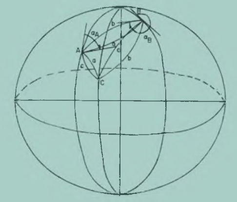

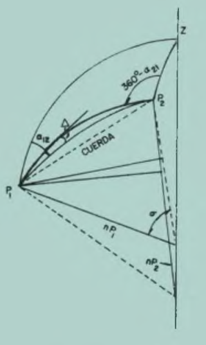

$$
Donde \qquad \phi_{m}=\frac{\phi_{P1}+\phi_{P2}}{2} \qquad (31) \\ \sigma=\frac{S}{Nm} \\ Nm=\frac{N_1+N_2}{2}  \qquad (31a)
$$


Como ejemplo. Una linea P1P2 con 200km de longitud  y condiciones máximas $\phi=0º \qquad \alpha_{PR}=45º$ equivale a $\Deltaº=0.36''$ ya muchas lineas poligonales o lineas de triangulacion  son mas cortas que esta  y debido a que la situacion  maxima no siempre ocurre , el valor de $\Delta$ es un valor pequeño y en ultima instancia practicamente despreciable.

#### Curva geodésica
La geodesica o linea geodesica entre dos puntos cualquiera sobre la superficie del elipsoide es la curva unica sobre la superficie entre dos puntos. En eun punto cualquiera a los largo de la geodésica, el radio principal del vector de curvatura es coincidente con la normal elipoidal.

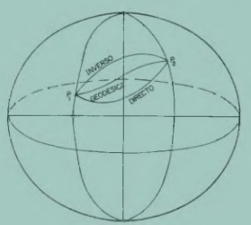

la geodesica figura 13 entre dos puntos P1 y P2 es la distancia menor sobre la superficie entre esos dos puntos

La posicion de la geodesica respecto de las secccioes normales directas e inversas se muetra en la fig 13

Para describir matmaticamente la geodesica, desarrollaremos las ecuaciones diferenciales para lineas geodesicas sobre una superficie de revolucion. La diferencial basica geometrica requerida se fundamenta en Phillips 1957 y Lipschuyz 1969. la ecuación general para una superficie de reovolucion puede expresarse como:

$$
F(X,Y,Z)=0  \qquad (32)
$$

las ecuaciones parametricas para una geodesica sobre esta superficie son

$$
X=f_1(S) \qquad Y=f_2(S) \qquad Z=f_3(S)  \qquad (33)
$$

Los cosenos diretos de la nornmal de la superficie son

$$
cos\beta_1=\frac{\frac{\partial F}{\partial X}}{D} \qquad cos\beta_2=\frac{\frac{\partial F}{\partial Y}}{D} \qquad cos\beta_3=\frac{\frac{\partial F}{\partial Z}}{D}  \qquad (34) \\ Donde \qquad D=[(\frac{\partial F}{\partial X})^2+(\frac{\partial F}{\partial Y})^2+(\frac{\partial F}{\partial Z})^2]^{1/2}  \qquad (35)
$$
Los cosenos directores de la normal principal a la curva son

$$
cos\beta_{N1}=R\frac{d^2X}{dS^2} \qquad cos\beta_{N2}=R\frac{d^2Y}{dS^2} \qquad cos\beta_{N3}=R\frac{d^2Z}{dS^2}  \qquad (36)
$$

Donde R es el radio principal de curvatura de la superficie. En la definición de la geodesica se establecio que en cualquier punto sobre la curva, al normal a la superficie el el radio vector principal (normal principal) estan siendo cincidentes. Para satisfacer esto se iguala 34 y 36 lo que resulta en 

$$
\frac{\frac{\partial F}{\partial X}}{\frac{d^2X}{dS^2}}=\frac{\frac{\partial F}{\partial Y}}{\frac{d^2Y}{dS^2}}=\frac{\frac{\partial F}{\partial Z}}{\frac{d^2Z}{dS^2}}  \qquad (37)
$$

Como se esta tratando con un elipsoide de revolucion, la superficie se puede representar por la ecuacion:

$$
X^2+Y^2+f(Z)=0  \qquad (38) \qquad Entonces \\ \frac{\partial F}{\partial X}=2X \qquad \frac{\partial F}{\partial Y}=2Y \qquad \frac{\partial F}{\partial Z}=f'(Z)  \qquad (39)\qquad sustituyendo \qquad 37 \\ Y\frac{d^2X}{dS^2}-X\frac{d^2Y}{dS^2}=0  \qquad (40) \qquad integrando \\
Ydx-Xdy=Cds  \qquad (41)

$$

Donde C es la constante de integración.

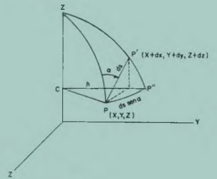

En la figura 14 la linea PP' representa una parte diferencial de una geodesica sobre la superficie del elipsoide. Teniendo la coordenadas cartesianas de P(X,Y,Z) podemos calcular las coordenadas de P(X+dx,Y+dy,Z+dz) ya que ds es una distancia muy pequeña. Las coordenadas de A (Proyección de P'), sobre el plano del paralelo de latitud P, son entonces X+dx, Y+dy, Z. El radio de éste paraelo es simbolizado por r. El area del triangulo CPA es:

$$
Area \qquad CPA=\frac{1}{2}(Ydx-ydy)  \qquad (42)\qquad y \qquad PP''C=\frac{1}{2}(r*ds*sen\alpha)  \qquad (43)\\ si \qquad ds \qquad pequeño \\
Area \qquad CPA=PP''C \qquad entonces \\
\frac{1}{2}(Ydx-ydy)=\frac{1}{2}(r*ds*sen\alpha)  \qquad (44) \qquad sustituyendo \\ C*ds=r*sen\alpha*ds \qquad (45) \qquad o \qquad C=r*sen\alpha \qquad (46) \qquad finalmente \\ sustituyendo \qquad 17 \qquad en \qquad  46\\C=Ncos\phi*sen\alpha \qquad (47)
$$

Para cualquier punto a los largo de una geodesica sobre la superficie de un elipoide de revolucion. En caluclos de geodesia geometrica es necesario definir los azimuts directo e inverso respecto a la misma curva sobre la superficie y no respecto a las dos secciones normales. Por lo tanto necesitamos  la separacion entre la secion normal y las curvas geodesicas. la separacion esta dada por (zacatov 1953 pag. 41-51)

$$
\delta=\frac{\Delta}{3} \qquad (48)
$$

Donde $\delta$ es el angulo entre la seccion de normal directa y geodesica en cualquier punto, y $\Delta$ es el angulo entre las seccciones normales reciprocas entre dos puntos. 

Luego las distancia S entre dos puntos sobre la superficie de un elipsoide es diferente si uno usa sección normal mayor que la geodesica. la diferencia está dada por (Zacatov, 1953 pag. 51)

$$
\Delta=\frac{a*e^4*sen^22\alpha*2cos^4\phi m*\sigma^6}{360}...(49)
$$

La que para una linea de 600 km en longitud es apropiadamente $9x10^{-6}m$ lo que es despreciable para propósitos prácticos

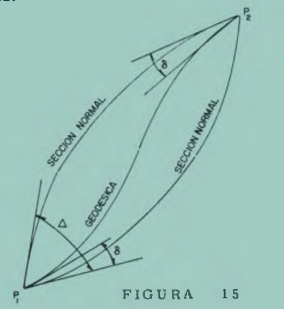

### Coordenadas esféricas
Este apartado muestra el resumen de las fórmulas que se utilizan para determinar distancias y acimutes de coordenadas esféricas. 

La ruta más corta entre dos puntos en la esfera se conoce como el gran circulo. Esto puede definirse por la intersección con la esfera de un plano que pasa a través de los puntos y el centro de la esfera. Las coordenadas de dos puntos, A y B,  como ($\phi_A, \lambda_A$) y ($\phi_B, \lambda_B$) respectivamente. La gran distancia de círculo $L_{AB}$ entre los dos puntos se da como

$$
cos(L_{AB})=sin(\phi_A)sin(\phi_B)+cos(\phi_A)cos(\phi_B)cos(\Delta\lambda)
$$

Donde $\Delta\lambda$ es la diferencia entre la longitud entre dos puntos.

Esto da una respuesta en unidades angulares, que se pueden convertir a distancia expresando el ángulo en radianes y multiplicándolo por un valor apropiado para el radio de Tierra esférica:

$$
L_{(km)}=6371\frac{\pi}{180}L_{(grados)}
$$

El acimut del punto B desde A se define como el ángulo en el sentido de las agujas del reloj entre meridiano en A y el gran círculo, y viene dado por la expresión:

$$
cot(A_{AB})=\frac{cos(\phi_A)tan(\phi_B)-sin(\phi_A)cos(\Delta\lambda)}{sin(\Delta\lambda)}
$$

### Coordenadas en el elipsoide
#### Geodesica
Las coordenadas geodesicas en el elipsoide se definen como latitud $\phi$, longitud $\lambda$ y altura $h$ como se aprecia en la figura. Estas coordenadas elipsoidales, o geodesicas, permiten definir un punto P en la superficie del elipsoide. Donde la latitud y la longitud se definen con respecto a la dirección de la normal esferoidal, una línea desde el punto en cuestión que es perpendicular al esferoide.

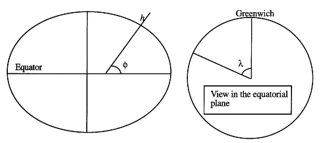

La longitud geodésica es el angulo expresado en grados sexagesimales formado por el plano del meridiano origen (Greenwich) y el meridiano que pasa por el punto P. Las longitudes se cuentan a ambos lados de del meridiano origen (hasta los 180º) siendo positivas al este y negativas al oeste.

la latitud geodésica es el angulo, expresado en grados sexagesimales, formado por la normal en el elipsoide desde el punto P y el plano ecuatorial. dicha normal no pasa por el centro del elipsoide, pero pasa por el eje polar. la latitud puede ser norte o sur según el hermisferio que se encuentre.

#### Geocentrica
Se denomina latitud geocentrica $\psi$ a la referida al centro del elipsoide. La relación entre las latitudes geodesica y geocentrica viene dada por:

$$
tan \ \phi=\frac{a^2}{b^2}tan \ \psi
$$

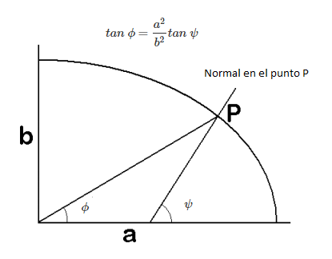

#### latitud reducida
La latitud reducida se define trazando una semicircunferencia de radio igual a "a" y haciendo pasar por P una perpendicular al eje mayor. El punto en el que ésta corta a la semicircunferencia se une con el centro , obteniendo el angulo $\beta$, que se denomina *latitud reducida*. La relación entre la latitud geodesica y la latitud reucida es:

$$
tan \ \phi=\frac{a}{b}tan \ \beta
$$

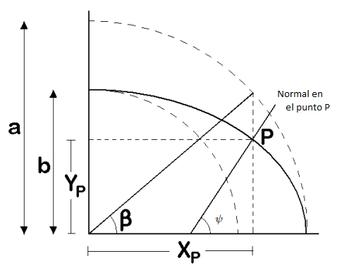

### Orientación geodésica
La orientación se materializa por la recta intersección del plano tangente al elipsoide en el vértice y el plano meridiano (plano que contiene al eje de la Tierra, o eje polar) que pasa por él. Esta intersección se llama meridiana (ver figura) y a ella se refiere la orientación de cualquier alineación que contenga al vértice.

El ángulo formado por una alineación y la meridiana se llama acimut. Los acimutes geodésicos se cuentan a partir del Sur y en el sentido creciente de las agujas del reloj, como el $A_P^Q$. Los azimutes topográficos se considerana partir del norte y en el mismo sentido que los geodesicos, por lo que difieren en 180º.

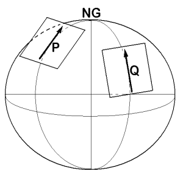

Las meridianas en dos puntos distintos $P$ y $Q$ no son paralelas, existiendo una diferencia angular $\omega$, llamada *convergencia de meridianos* debida a que los planos meridianos no son paralelos, sino que cortan en el eje polar. EL valor de la convergencia de meridianos depende de las posiciones relativas de ambos puntos. Asi, la relación entre los azimutes reciprocos de una determinanda alineación (por ejemplo PQ) es:

$$
A_P^Q=A_Q^P\pm \omega \ \pm 180º \\
Siendo  \ aproximadamente \ la \ convergencia \qquad \omega=(\lambda_Q-\lambda_P)sen\frac{\phi_P+\phi_Q}{2}
$$


### Problema geodésico directo e inverso
#### Formula de Puissat 
La formulación se llama así en honor al matemático Francés Puissant. Su derivación está basada sobre una aproximación esférica. Estas fórmulas estan consideradas con una precisión de 1ppm en 100km mas alla de lo cual su precision decrece rapidamente 40pp en 250km cuando $\phi=60º$ (Bomford, 1971 pag. 134). Por lo que se dice que la fórmula de Puissant es una formula de línea *corta*.

#### Problema directo
Dadas las cantidades geodesicas $\phi_1,\lambda_1, S_{12},a_{12}$ (figura 19), se quiere calcular las cantidades $\phi_2,\lambda_2,a_{21}$. En la derivación calculamos primero $\phi_2$. Obtenemos, por la proximacion esferica (trigonometria esferica-ley de los cosenos):

$$
sen\phi_2=sen\phi_1cos(\bar{P1P2})+cos\phi_1sen(\bar{P1P2})cos\alpha \qquad(73)
$$

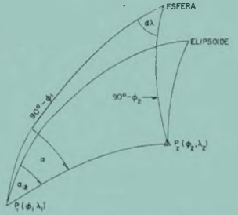

Dado que los meridianos estan en el mismo plano

$$
\bar{P1P2}=\frac{S_{12}}{N_1} \qquad \phi_2=\phi_1+d\phi \qquad \alpha=\alpha_{12} \qquad entonces \\ sen(\phi_1+d\phi)=sen\phi_1cos(\frac{S_{12}}{N_1})+cos\phi_1sen(\frac{S_{12}}{N_1})cos\alpha_{12} \qquad (74)
$$

Ahora se requiere una expresion para $d\phi$. de la ecuacion 74 se puede expresar la parte del lado izquierdo por:

$$
sen(\phi_1+d\phi)=sen\phi_1cos(d\phi)+cos\phi_1sen(d\phi) \qquad (75)
$$

La formula anterior no nos dara la solucion requerida puesto que $d\phi$ aparece del lado derecho de la ecuacion. Para comenzar la soluiond el problema se utiliza nuevamente la aproximacion esferica:

$$
d\phi=\frac{S_{12}}{N_1}cos\alpha_{12}...(81) \qquad sustituyendo \\ d\phi=\frac{S_{12}}{N_1}cos\alpha_{12}-\frac{S_{12}^2}{2N_1^2}tan\phi_{1}-\frac{S_{12}^3}{6N_1^3}cos\alpha_{12}+\frac{S_{12}^2}{2N_1^2}cos\alpha_{12}tan\phi_{1}+\frac{d\phi^3}{6}+...(82)
$$

De 82 se puede obtener una aproximacion mas precisa para $d\phi$ (despreciando lso terminos mayores que la segunda potencia nombrada)

$$
d\phi=\frac{S_{12}}{N_1}cos\alpha_{12}-\frac{S_{12}^2}{2N_1^2}tan\phi_{1}(1-cos^2\alpha_{12})+...(83) \qquad simplificando\\
d\phi=\frac{S_{12}}{N_1}cos\alpha_{12}-\frac{S_{12}^2}{2N_1^2}tan\phi_{1}sen^2\alpha_{12}+...(84) \qquad elevando \qquad /^2 \\
d\phi^2=\frac{S_{12}^2}{N_1^2}cos^2\alpha_{12}-\frac{S_{12}^2}{2N_1^2}cos\alpha_{12} sen^2\alpha_{12} tan\phi_{1}+...(85) \qquad posteriormente \\ d\phi^3=\frac{S_{12}^3}{N_1^3}cos^3\alpha_{12}+...(86)
$$

Sustitiyendo 85 y 86 en 80 y reordenando terminos

$$
d\phi=\frac{S_{12}}{N_1}cos\alpha_{12}-\frac{S_{12}^2}{2N_1^2}tan\phi_{1}-\frac{S_{12}^3}{6N_1^3}cos\alpha_{12}+\frac{S_{12}^2}{2N_1^2}cos^2\alpha_{12}tan\phi_1-\frac{S_{12}^3}{2N_1^3}cos\alpha_{12}sen^2\alpha_{12}tan\phi_1+\frac{S_{12}^3}{N_1^3}cos^3\alpha_{12}+...(87)\\
resumiendo\\
d\phi=\frac{S_{12}}{N_1}cos\alpha_{12}-\frac{S_{12}^2}{2N_1^2}tan\phi_{1}sen^2\alpha_{12}-\frac{S_{12}^3}{2N_1^3}cos\alpha_{12}sen^2\alpha_{12}tan^2\phi_1-\frac{S_{12}^3}{6N_1^3}cos\alpha_{12}sen^2\alpha_{12}...(88) \qquad simplificando\\
d\phi=\frac{S_{12}^3}{6N_1}cos\alpha_{12}sen\alpha_{12}(1+3tan^2\phi_1)...(89) \qquad en \qquad 88 \\ 
d\phi=\frac{S_{12}}{N_1}cos\alpha_{12}-\frac{S_{12}^2}{2N_1^2}tan\phi_{1}sen^2\alpha_{12}-\frac{S_{12}^3}{6N_1^3}cos\alpha_{12}sen^2\alpha_{12}(1+3tan^2\phi_1)...(90)
$$

La ecuacion 90 no es una solucion rigurosa, puesto que el radio de curvatura a traves de la seccion normal de P1 a P2 se esta tomando como un valor constante N1, cuando de hecho, cambia con la latitud ($N=f_1(\phi) \qquad N=f_2(\phi)$). para tomar este cambio en cuenta se puede escribir.

$$
d\phi=\frac{1}{Mn}[lado \qquad derecho \qquad de  \qquad 90]...(91)\\ Donde: Mn=\frac{M_1+M_2}{2}...(92)
$$

En orden el calculo de $M_2$. De 13 calculamos:

$$
\frac{dM_1}{d\phi}=a(1-e^2)(-3/2)(1-e^2sen^2\phi_1)^{-5/2}(-2e^2sen\phi_1)cos\phi_1...(94)\\
d\lambda-\frac{d\lambda^3}{6}+...=(\frac{S_{12}}{6N_2^3}-\frac{S_{12}^3}{6N_2^3}...)(sen\alpha_{12s}sec\phi_2)...(103) \qquad ó \\
d\lambda=\frac{S_{12}}{N_2}sen\alpha_{12}sec\phi_2-\frac{S_{12}^3}{6N_2^3}sen\alpha_{12}sec\phi_2+\frac{d\lambda^3}{6}...(103a)
$$

Ahora, de los dos primeros terminos de 103a (despreciando los terminos mayores a la tercera potencia)

$$
d\lambda^3=\frac{S_{12}^3}{6N_2^3}sen^3\alpha_{12}sec^3\phi_2+...(104) \qquad finalmente \\
d\lambda''=p''[\frac{S_{12}}{N_2}sen\alpha_{12}(1-\frac{S_{12}^2}{6N_2^3}(1-sen^2\alpha_{12}sec^2\phi_2))]...(105)
$$

Lo cual cuando es colocado en 101 da la solucion para $\lambda_2$.

Resumiendo los pasos para la solución del prolema directo usando la formula de Puissant:

1. Calcular M1 y N1 usando las ecuaciones $M=\frac{a(1-e^2)}{\left [1-e^2sen^2\phi  \right ]^{3/2}} \qquad (13)$ y $N=\frac{a}{\left [1-e^2sen^2\phi  \right ]^{1/2}} \qquad (15)$
2. Calcular una $d \phi''$ aproximada con $d\phi=\frac{S_{12}}{N_1}cos\alpha_{12}-\frac{S_{12}^2}{2N_1^2}tan\phi_{1}sen^2\alpha_{12}-\frac{S_{12}^3}{6N_1^3}cos\alpha_{12}sen^2\alpha_{12}(1+3tan^2\phi_1)...(90)$
3. Resuelva para $d \phi''$ usando $d\phi''=[p''\frac{S_{12}cos\alpha_{12}}{M_1}-\frac{S_{12}^2tan\phi_1sen\alpha_{12}}{2M_1N_1}-\frac{S_{12}^3cos\alpha_{12}sen\alpha_{12}(1+3tan^2\phi_1)}{6M_1N_1^2}+[1-\frac{3e^2sen\phi_1cos\phi_1}{2(1-3e^2sen^2\phi_1)}(\frac{d\phi}{p''})]]...(99)$ y $\phi_2$ usando $\phi_2=\phi_1+d\phi...(100)$
4. Calcular $N_2$ con $N=\frac{a}{\left [1-e^2sen^2\phi  \right ]^{1/2}} \qquad (15)$
5. Resolver para $d \lambda''$ con d\lambda''=p''[\frac{S_{12}}{N_2}sen\alpha_{12}(1-\frac{S_{12}^2}{6N_2^3}(1-sen^2\alpha_{12}sec^2\phi_2))]...(105) y $\lambda_2$ usando $\lambda_2=\lambda_1+d\lambda...(101)$
6. Usando $d\alpha''=p''[d\lambda \ sen{\phi_m} \ sec\frac{d\phi}{2}+\frac{d\lambda^3}{12}[sen{\phi_m} \ sec\frac{d\phi}{2}-sen^3{\phi_m} \ sec^3(\frac{d\phi}{2})+]] \qquad (115)$, calcular $d \alpha''$ y finalmente $\alpha_{21}$ con $\alpha_{21}=\alpha_{12}+d\alpha+180...(109a)$

#### Problema Inverso
Aqui estamos dando cantidades de P1 $\phi_1,\lambda_1$ y de P2 $\phi_2,\lambda_2$ (figura 20). Las cantidades requeridas son $S_{12}, \alpha_{12}$ y $\alpha_{21}$. Comenzamos por determinar $\alpha_{21}$. Usando la aproximacion esferica.

$$
P'P1P2=360\alpha_{21}...(106) \qquad y \\
\frac{1}{2}(P'P1P2+\hat{P'P2P1})=\frac{1}{2}(\alpha_{12}+360-\alpha_{21})...(107)\\
\alpha'_{12}-\alpha_{12}=d\alpha...(108) \qquad ó \qquad \alpha'_{12}=d\alpha+a_{12}...(108a)
$$

Donde $d\alpha$ es el termino que expresa la convergencia de los meridianos entre los puntos P1 y P2. usando la figura 20, podemos escribir:

$$
\alpha_{21}=\alpha'_{12}+180...(109) \qquad sustituyendo \qquad a'_{12} \\
\alpha_{21}=\alpha_{12}+d\alpha+180...(109a) \qquad sustituyendo \qquad a_{21} \qquad en \qquad (107)\\
\frac{1}{2}(P'P1P2+\hat{P'P2P1})=\frac{1}{2}(\alpha_{12}+360-\alpha_{12}-d\alpha-180)...(110) \qquad reduciendo \\
\frac{dM_1}{d\phi}=M_1\frac{3e^2sen\phi_1cos\phi_1}{(1-e^2sen^2\phi_1)}...(95) \qquad sustituyendo \qquad en \qquad (92) \\
Mm=\frac{M_1+(M_1+dM_1)}{2}=M_1+\frac{dM_1}{2}...(96)\\
Mm=M_1+\frac{dM_1}{d\phi_1}(\frac{d\phi''}{2p''})...(96a)\\
Mm=M_1+\frac{3}{2}M_1\frac{e^2sen\phi_1cos\phi_1}{(1-e^2sen^2\phi)}(\frac{d\phi''}{2p''})...(97) \\
de \qquad (97) \qquad \frac{1}{Mm}=\frac{1}{M_1}+[1-\frac{3}{2}M_1\frac{e^2sen\phi_1cos\phi_1}{(1-e^2sen^2\phi)}(\frac{d\phi''}{2p''})]...(98) \qquad colocando \qquad en \qquad (91) \\
d\phi''=[p''\frac{S_{12}cos\alpha_{12}}{M_1}-\frac{S_{12}^2tan\phi_1sen\alpha_{12}}{2M_1N_1}-\frac{S_{12}^3cos\alpha_{12}sen\alpha_{12}(1+3tan^2\phi_1)}{6M_1N_1^2}+[1-\frac{3e^2sen\phi_1cos\phi_1}{2(1-3e^2sen^2\phi_1)}(\frac{d\phi}{p''})]]...(99)
$$

Donde $d\phi$ en el ultimo termino de (99) es calculado usando la ecuacion (90) (multiplicad por P'')

Finalmente calculamos $\phi_2$ por:

$$
\phi_2=\phi_1+d\phi...(100)
$$

La longitud de P2 puede calcularse:

$$
\lambda_2=\lambda_1+d\lambda...(101)
$$

De la figura 19 usando una aproximacione sferica (ley de los senos)

$$
\frac{send\lambda}{sen\frac{S_{12}}{N_2}}=\frac{sen\alpha_{12}}{sen(90-\phi_2)}...(102) \qquad ó \qquad  send\lambda=sen\frac{S_{12}}{N_2}sen\alpha_{12}sec\phi_2...(102a)
$$

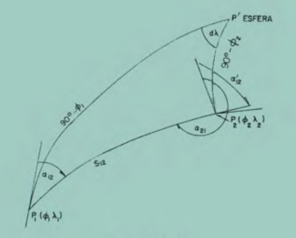

Ahora aproximando los terminos senoidales sobre cada lado de (102a) por una serie de Taylor, podemos escribir (despreciando los terminos a la tercera potencia)

$$
\frac{1}{2}(\hat{P'P1P2}+\hat{P'P2P1})=90-\frac{d\alpha}{2}...(110a)
$$

Usando trigonometría esferica, la ley de las tangentes

$$
tan(90-\frac{d\alpha}{2})=cot\frac{d\lambda}{2}\frac{cos\frac{1}{2}[(90-\phi_2)-(90-\phi_1)]}{cos\frac{1}{2}[(90-\phi_2)+(90-\phi_1)]}...(111) \qquad reduciendo \\
tan(\frac{d\alpha}{2})=\frac{cos[90-\frac{\phi_1+\phi_2}{2}]}{cos\frac{1}{2}(\phi_1-\phi_2)}tan\frac{d\lambda}{2}...(112) \qquad o \qquad tan(\frac{d\alpha}{2})=\frac{sen\frac{1}{2}(\phi_1+\phi_2)}{cos\frac{d\phi}{2}}tan\frac{d\lambda}{2}...(112a)
$$

Enseguida desarrollamos los terminos tangentes sobre amboslados de (112a) que pueden ser expresados por (despreciando los terminos mayores a la tercera potencia)

$$
tan\frac{d\alpha}{2}=sen\phi m sec\frac{d\phi}{2}(\frac{d\lambda}{2}+\frac{d\lambda^3}{24}+...)...(113) \qquad y \\
tan\frac{d\alpha}{2}=\frac{d\alpha}{2}+\frac{d\alpha^3}{24}+...(114)
$$
Lo cual nos da la ecuacion final

$$
d\alpha''=p''[d\lambda \ sen{\phi_m} \ sec\frac{d\phi}{2}+\frac{d\lambda^3}{12}[sen{\phi_m} \ sec\frac{d\phi}{2}-sen^3{\phi_m} \ sec^3(\frac{d\phi}{2})+]] \qquad (115)
$$

Donde $\phi_m$ es la latitud media.

Sustituyendo $d \alpha$ en (109a) por 115 nos da $\alpha_{21}$. La solución  para $\alpha_{12}$ es, tomando la ecuacion (99) 

$$
S_{12}cos{\alpha_{12}}=[\frac{d\phi}{p}''M_1 + \frac{S_{12}^2 tan{\phi_1} sen^2{a_{12}}}{2M_1N_1} + S^3_{12}  cos{\alpha_{12}} sen{\alpha_{12}} (1+tan^2{\phi_1}) ] \qquad (116) \\ usando \ 105 \\
S_{12}sen{\alpha_{12}}=\frac{d \lambda''N_2}{sec{\phi_2p''}}+\frac{S^3_{12}}{6N_2^3}sen{\alpha_{12}sec{\phi_2}}-\frac{S^3_{12}}{6N_2^2}sen{\alpha_{12}sec^3{\phi_2}} \qquad (117) \\
dividiendo \ (117) \ entre \ (116) \\
tan{\alpha_{12}}=\frac{117}{116} \qquad (118) 
$$

Puesto que $\alpha_{12}$ aparece sobre el lado derecho de (118) se requiere iterar. Primero obteniendo valores aproximados para $\alpha_{12}$ de (118) usando solamente el primer termino en el numerador  y de denominador y para $S_{12}$ de (116) o (117) usando nuevamente sólo el primer termino del lado derecho de las ecuaciones. valores más precisos de $\alpha_{12}$ y $S_{12}$ son obtenidos usando  todos los terminos en (118) y (116) o (117) respectivamente. Se itera hasta que la discrepancia sea despreciable.  

Resumiendo lso pasos para la solución del problema inverso con las formulas de Puissant

1. Calcule M1 con $M=\frac{a(1-e^2)}{\left [1-e^2sen^2\phi  \right ]^{3/2}} \qquad (13)$ y $N_1$ y $N_2$ con $N=\frac{a}{\left [1-e^2sen^2\phi  \right ]^{1/2}} \qquad (15)$
2. Calcule $\alpha_{12}$ con $tan{\alpha_{12}}=\frac{117}{116} \qquad (118)$
3. Calcule $d \alpha''$ con $d\alpha''=p''[d\lambda \ sen{\phi_m} \ sec\frac{d\phi}{2}+\frac{d\lambda^3}{12}[sen{\phi_m} \ sec\frac{d\phi}{2}-sen^3{\phi_m} \ sec^3(\frac{d\phi}{2})+]] \qquad (115)$, luego $\alpha_{21}$ usando $\alpha_{21}$ con $\alpha_{21}=\alpha_{12}+d\alpha+180...(109a)$
4. Usando cuanquiera de las siguientes ecuaciones $S_{12}cos{\alpha_{12}}=[\frac{d\phi}{p}''M_1 + \frac{S_{12}^2 tan{\phi_1} sen^2{a_{12}}}{2M_1N_1} + S^3_{12}  cos{\alpha_{12}} sen{\alpha_{12}} (1+tan^2{\phi_1}) ] \qquad (116)$ o $S_{12}sen{\alpha_{12}}=\frac{d \lambda''N_2}{sec{\phi_2p''}}+\frac{S^3_{12}}{6N_2^3}sen{\alpha_{12}sec{\phi_2}}-\frac{S^3_{12}}{6N_2^2}sen{\alpha_{12}sec^3{\phi_2}} \qquad (117)$ calcule $S_{12}$.

```{r}

```
